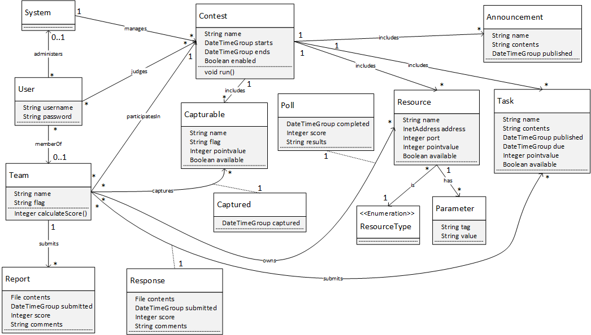

# BeanPoll Developer Documentation

**NOTE:**
Please begin with the [BeanPoll README](../beanpoll/README/md "BeanPoll README"). The Security and Usage sections will provide significant context for the information here.

## Domain Model

## JEE Architecture

